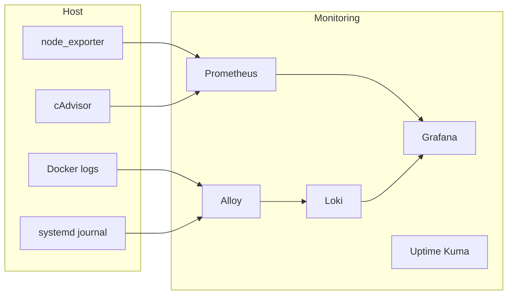

# Monitoring Stack

[](https://github.com/fabianwimberger/monitoring-stack/actions)
[](https://opensource.org/licenses/MIT)

A Docker Compose monitoring stack for self-hosted infrastructure. Metrics, logs, dashboards, and uptime monitoring in one command.

- **Metrics** — Prometheus + cAdvisor + node_exporter
- **Logs** — Loki + Grafana Alloy (Docker containers + systemd journal)
- **Dashboards** — Grafana with pre-provisioned dashboards
- **Uptime** — Uptime Kuma for endpoint monitoring

## Background

I kept setting up the same Prometheus, Grafana, and Loki combination on every self-hosted box. This is that stack packaged as one command, with the pieces I actually use: cAdvisor and node_exporter for metrics, Alloy for Docker and systemd-journal logs, Uptime Kuma for endpoint checks, and Grafana with dashboards already wired up.

## Architecture



## Quick Start

### Option 1: Local / LAN

For testing or running on your local network with direct port access:

```bash
git clone https://github.com/fabianwimberger/monitoring-stack.git
cd monitoring-stack

# Optional: edit settings
cp .env.example .env

# Start
make up
```

| Service | URL |
|---|---|
| Grafana | http://localhost:3000 |
| Prometheus | http://localhost:9090 |
| Uptime Kuma | http://localhost:3001 |

Default Grafana login: `admin` / `admin` (set `GRAFANA_ADMIN_PASSWORD` in `.env` to change).

### Option 2: Behind a Reverse Proxy

If you run [Traefik](https://traefik.io/) (or similar) already, use the proxy overlay:

```bash
cp .env.example .env
# Edit .env and set your domains:
#   GRAFANA_DOMAIN=grafana.example.com
#   UPTIME_KUMA_DOMAIN=uptime.example.com

make up-proxy
```

This exposes **only** Grafana and Uptime Kuma via your reverse proxy. Prometheus, Loki, Alloy, and cAdvisor stay on an isolated internal network with no public access.

See `docker-compose.proxy.yml` if you use a different proxy — the labels are easy to adapt.

## Network Isolation

The compose setup uses two networks:

- **`monitoring`** — internal communication between Prometheus, Loki, Alloy, and cAdvisor
- **`proxy`** — for services that need external access (Grafana, Uptime Kuma)

In proxy mode, backend services have no exposed ports and no route from the outside. Grafana and Uptime Kuma are the only entrypoints.

## Screenshots

*TODO: Add screenshots of the pre-provisioned dashboards here*

- Host monitoring dashboard (CPU, memory, disk, network)
- Log explorer (search across Docker containers and systemd journal)
- Uptime Kuma status page

## Configuration

All settings are via `.env` (see [`.env.example`](.env.example)):

| Variable | Default | Description |
|---|---|---|
| `TZ` | `UTC` | Timezone for all services |
| `PROMETHEUS_PORT` | `9090` | Prometheus web UI port (local mode) |
| `PROMETHEUS_RETENTION` | `30d` | Metrics retention |
| `GRAFANA_PORT` | `3000` | Grafana web UI port (local mode) |
| `GRAFANA_ADMIN_PASSWORD` | `admin` | Grafana admin password |
| `UPTIME_KUMA_PORT` | `3001` | Uptime Kuma web UI port (local mode) |
| `GRAFANA_DOMAIN` | — | Domain for Grafana (proxy mode) |
| `UPTIME_KUMA_DOMAIN` | — | Domain for Uptime Kuma (proxy mode) |
| `PROXY_NETWORK` | `proxy` | Name of your external Docker proxy network |

### Adding Hosts to Monitor

Edit `config/prometheus.yml` and add your `node_exporter` instances:

```yaml
scrape_configs:
  - job_name: "node"
    static_configs:
      - targets: ["192.168.1.10:9100", "192.168.1.11:9100"]
```

### Adding Dashboards

Drop Grafana dashboard JSON files into `dashboards/`. They are auto-provisioned on startup.

## Requirements

- Docker and Docker Compose v2
- Linux host (for systemd journal and cAdvisor access)
- [node_exporter](https://github.com/prometheus/node_exporter) installed on hosts you want to monitor
- For proxy mode: an existing reverse proxy (Traefik, Nginx, Caddy, etc.)

## Makefile Commands

| Command | Description |
|---|---|
| `make up` | Start stack (local mode) |
| `make down` | Stop stack |
| `make restart` | Restart all services |
| `make logs` | Follow logs |
| `make clean` | Stop and remove all volumes (**deletes data**) |
| `make up-proxy` | Start stack behind reverse proxy |
| `make down-proxy` | Stop proxy stack |

## License

[MIT](LICENSE)
